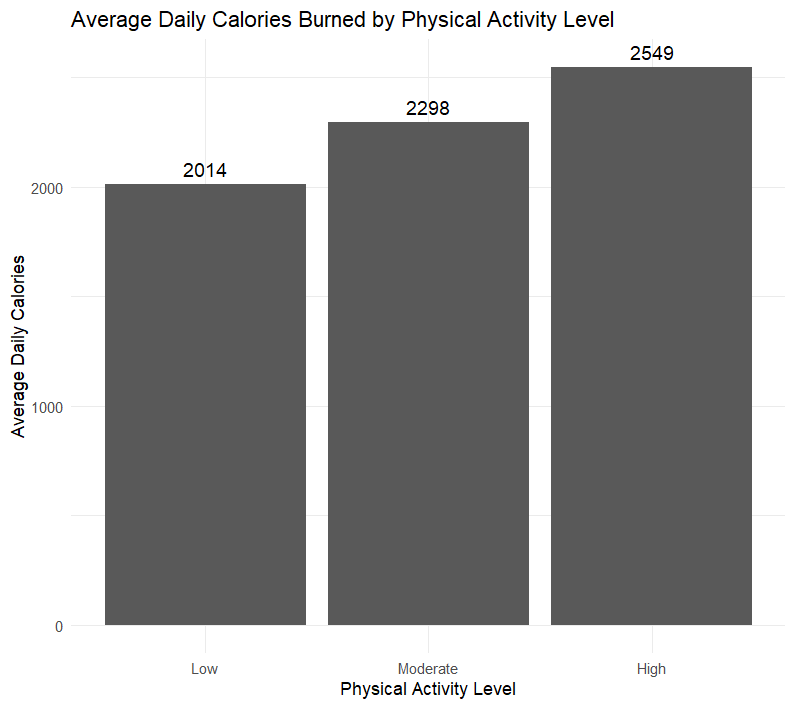

# 🏃‍♀️ Bellabeat Case Study – Data Analysis

  

## 📌 Project Overview
This project is an **end-to-end exploratory analysis** of smart device data (Bellabeat). The goal is to analyze user habits regarding activity, sleep, and heart rate to provide data-driven recommendations for product strategy.

Unlike typical analyses, this project emphasizes **methodological rigor and data quality** over simple prediction.

### 🖼️ Preview

*Example visualization from the analysis. Average daily calorie expenditure increases significantly with activity intensity, highlighting the importance of sustained moderate-to-high activity over the type of day.*


---

## 🛠️ Tools & Technologies
The analysis was conducted entirely in **R** within a reproducible workflow:
* **Data Manipulation:** `tidyverse`, `dplyr`, `tidyr`, `lubridate`
* **Visualization:** `ggplot2`
* **Documentation:** R Markdown

---

## 🔍 Key Findings
Based on the analysis of user daily habits, the core insights are:

1.  **Consistency:** User activity levels are remarkably stable across weekdays and weekends; there is no significant "weekend warrior" effect.
2.  **Steps vs. Sleep:** Surprisingly, raw step count is a **weak predictor** of sleep duration or quality.
3.  **Intensity Matters:** Users with *moderate* activity showed better heart rate metrics than those with sporadic high intensity, highlighting the value of consistency.
4.  **Energy Expenditure:** Average daily calories burned increase substantially with higher activity levels, regardless of weekday or weekend.


---

## 📚 Full Reports & Methodology
For a deep dive into the **"how" and "why"** behind the analysis — including data cleaning decisions, methodological choices, and statistical reasoning — please refer to the following reports, organized by level of detail:

| Report Type | Audience | Description |
| :--- | :--- | :--- |
| **[Executive Summary](reports/executive_summary.md)** | Stakeholders | One-page overview of key insights and business recommendations. |
| **[Case Study Report](reports/bellabeat_final_report.md)** | Recruiters & Clients | Concise analytical narrative explaining the workflow, insights, and decision-making process. |
| **[Full Technical Report](reports/bellabeat_final_report_full.md)** | Data Professionals | Comprehensive methodology, data cleaning logic, statistical reasoning, limitations, and code references. |

> *This project emphasizes data quality, methodological rigor, and analytical transparency.*


---

## 📂 Repository Structure
```text
├── data/              # Raw and processed datasets
├── scripts/           # Modular R scripts for each research question (Q1-Q6)
├── figures/           # Exported visualizations
├── technical_notes/   # Detailed notes on transformations & outliers
├── reports/           # Final reports (PDF & MD)
└── README.md          # This file
